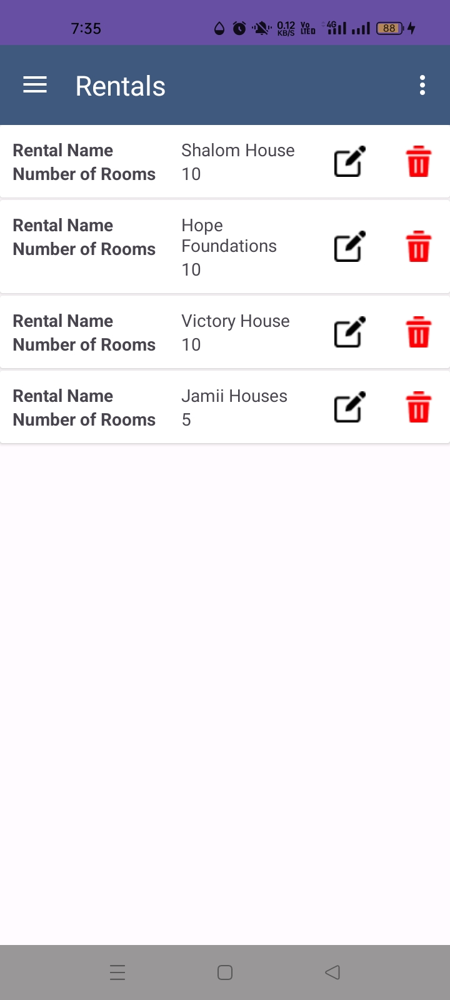
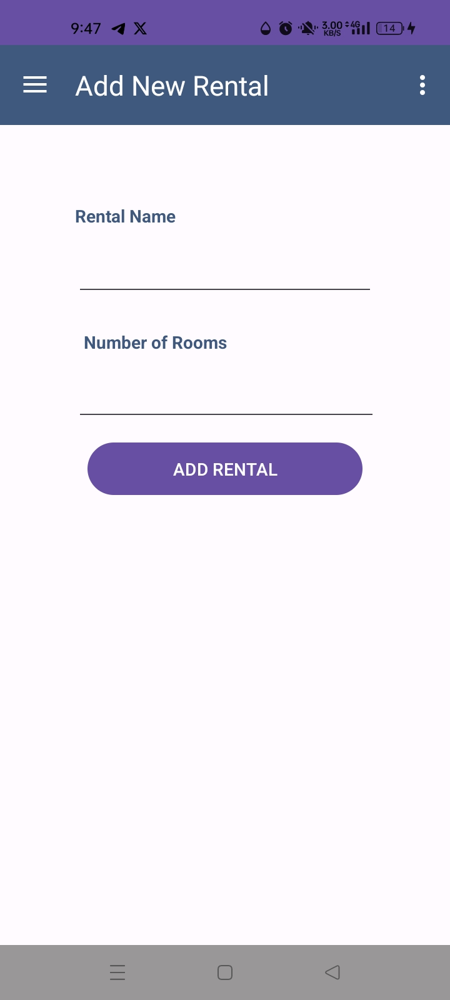
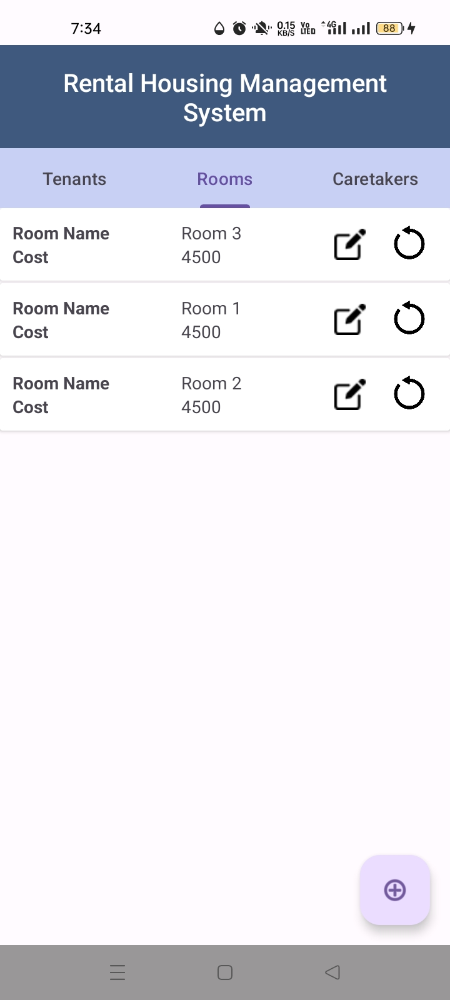
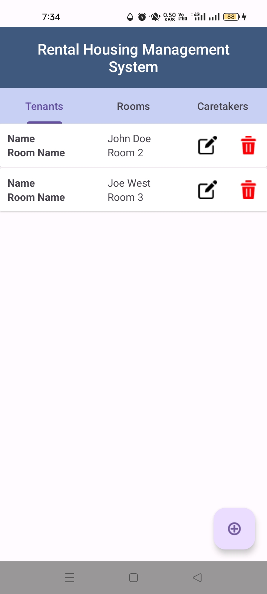
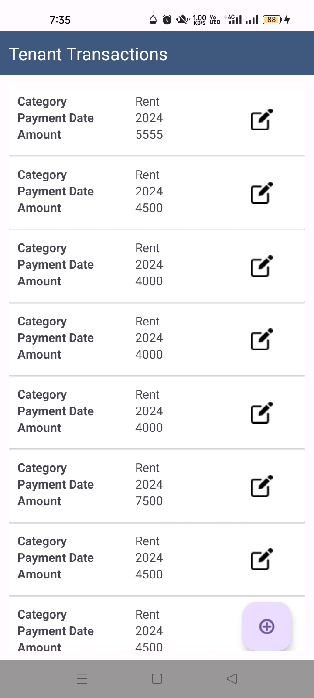

## Rental Housing Management System

This is a project meant for individual rental house owners who record room, tenant, caretaker, tenant accounting information manually in books.

### Authors
<ul>
<li>VickArmand</li>
</ul>

## Blog Article
<a href="https://vickarmand.github.io">CLICK HERE</a>

## Installation

It is an Android application, though it hasnt being uploaded to Play Store

## Usage
For a new owner you need to:
<ul>
<li>create the rentals first by clicking the naviation menu and selecting the <b>Add rental</b> option </img></img></li>
<li>in the rentals created add rooms by clicking the floating add icon on the bottom</img></li>
<li>add tenants and caretakers while assigning them the available rooms by clicking the floating add icon on the bottom</img></li>
<li>in the available tenants add some payments that they have transacted, whether its water, electricity, rent or maintenance bills by clicking the floating add icon on the bottom</img></li>
</ul>

## Contributing
<ul>
<li>VickArmand</li>
</ul>

## Licensing

Feel free to use software for free
